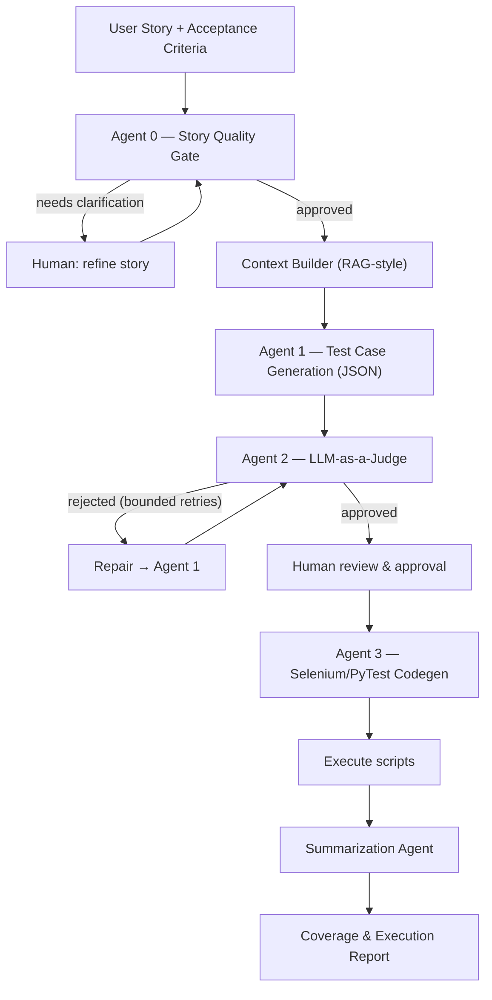

# QA Assistant Agent — LLM-Powered Test Generation Pipeline

A Generative-AI pipeline that turns **user stories + acceptance criteria** into
reviewed functional test cases and executable **Selenium/PyTest** automation
scripts, with a final coverage report.

The goal is **not** to replace the QA analyst, but to remove the mechanical work
of the early stages (reading requirements, extracting rules, writing baseline
scenarios) and leave humans only the decisions that genuinely require judgment.

> Academic project — UFRJ, B.Sc. in Computer Science, *Oficina de
> Desenvolvimento de Software I*. Partial report (AV1), Group 4.
> Advisor: Prof. Rafael de Mello.

---

## Why

Generating test cases is one of the biggest bottlenecks in QA: it is costly,
slow, and error-prone. Recent literature shows LLMs *can* generate useful test
artifacts, but they **systematically omit implicit requirements** (the edge
cases that matter most), and **output quality depends heavily on input quality**.

This pipeline addresses those findings with three integrated mechanisms the
literature usually treats separately:

1. **Input quality control** — a requirements quality gate *before* generation.
2. **Practical infrastructure** — a controlled PoC web app with stable
   selectors (`data-testid`) and a curated project context.
3. **Explicit review & traceability** — an LLM-as-a-Judge stage with a repair
   loop, plus criterion-to-test-case traceability.

---

## Architecture

The pipeline is composed of **five specialized agents** and a **context
builder**, running in sequence with a repair branch. No artifact advances
without verification, and the human reviews/approves — never writes from scratch.



| Component | Role | Output |
|---|---|---|
| **Agent 0 — Quality Gate** | Reviews the story/criteria for ambiguity, missing criteria, non-verifiable rules, missing data | JSON verdict (`APROVADA` / `PRECISA_DE_ESCLARECIMENTO`) |
| **Context Builder** | Aggregates project context (glossary, approved examples, screen map, selectors) to reduce hallucination; keeps injected context tight (RAG can increase verbosity — Correia et al.) | Assembled prompt context |
| **Agent 1 — Test Generation** | Generates positive/negative/edge cases using equivalence partitioning & boundary analysis | Structured test cases (JSON) + traceability matrix |
| **Agent 2 — LLM-as-a-Judge** | Reviews coverage, requirement fidelity, consistency, automatability; scores each dimension | Approve/reject verdict + suggested omissions |
| **Repair loop** | Failed cases return to Agent 1 with the judge's diagnosis (bounded iterations) | Revised test cases |
| **Agent 3 — Codegen** | Generates PyTest + Selenium scripts (Page Object Model, `data-testid`, `WebDriverWait`) | `conftest.py`, `pages.py`, `test_*.py` |
| **Summarization Agent** | Classifies failures (system / test / selector / data / environment) and reports coverage | Final coverage report (JSON) |

### Prompting techniques
Persona prompting · context injection · few-shot · structured JSON output ·
LLM-as-a-Judge · bounded repair loop · multi-candidate generation *(optional)*.

---

## Getting Started

Follow the steps below to configure and spin up the entire environment (database, frontend, backend, selenium, and the pipeline running a local LLM):

### 1. Configure Environment Variables
Copy the example environment file:
```bash
cp .env.example .env
```
*(Optional)* If you plan to use closed models (such as Gemini or Claude), populate the respective API keys (`GOOGLE_API_KEY`, `ANTHROPIC_API_KEY`) in the `.env` file.

### 2. Start the Docker Containers
Build and run the full stack in the background:
```bash
docker compose up -d --build
```
This builds and starts:
- **ollama**: Local LLM server, which automatically pulls and loads the `llama3` model on first run.
- **backend**: FastAPI application (exposed on host port `8001`).
- **frontend**: React + Vite application (exposed on host port `5173`).
- **selenium**: Standalone Chrome browser for test execution (ports `4444` and `7900`).

### 3. Run the Pipeline
To execute the pipeline container and run the integration test query (which pings the local Llama 3 instance to verify the connection):
```bash
docker compose run --rm pipeline
```

---

## Proof-of-Concept Application

A small web app built by the team to exercise the pipeline. **Backend: FastAPI ·
Frontend: React + Vite.** Interactive elements are tagged with `data-testid` from the
start to avoid the unstable-selector problem. The whole stack runs in **Docker**,
and the pipeline can drive **closed API models or local open models** (via an
`ollama` service), so both can be benchmarked on the same stories.

Covered flows: authentication, profile-based permissions, field validation,
persistence, and operations with explicit business rules.

### Initial User Stories

| ID | Story | Key acceptance criteria |
|---|---|---|
| **US-01** | Login with e-mail and password | Auth success → list screen · generic "E-mail ou senha inválidos" · lock for 60s after 5 consecutive failures |
| **US-02** | User registration (name, e-mail, password) | name 3–80 chars, valid e-mail, password ≥8 with letter+number · reject duplicate e-mail · confirm + redirect to login |
| **US-03** | Create service request (title, description, priority) | title 5–100, description 10–500, priority ∈ {baixa, média, alta} · auto status "aberta" + date · reject empty required fields |
| **US-04** | Filter requests by status and priority | default: own requests, newest first · combinable filters · "Nenhuma solicitação encontrada" without hiding controls |
| **US-05** | Cancel a non-finalized request | only "aberta"/"em análise" & owned · confirmation showing title · set "cancelada" + date, block further edits |

Each story has three criteria covering the happy path, a rejection rule, and an
edge/security behavior. Criteria use the `CA-XX.Y` numbering to feed the
traceability matrix.

---

## Evaluation

Evaluated via a controlled PoC against a fixed set of user stories and a human
oracle (gabarito). Metrics follow Silva et al. to allow direct comparison.

- **Test-case quality:** precision, recall, F1, omission rate, incorrect-fact
  rate, acceptance-criteria coverage.
- **Automation quality:** executable-scripts rate, functional success rate.
- **Pipeline-component efficacy:** judge precision/recall (vs. human review),
  perceived human effort (review time vs. manual authoring time).

---

## Repository Structure (target)

```
.
├── README.md                 # this file
├── docs/AGENTS.md            # guide for coding agents working in this repo
├── docs/PLAN.md               implementation plan & milestones
├── pipeline/                 # the QA assistant pipeline
│   ├── agents/               # agent 0–3, repair, summarizer
│   ├── context/              # context builder, glossary, ui_map
│   ├── prompts/              # one file per prompt (see plan.md §8)
│   ├── schemas/              # JSON schemas / models for agent I/O
│   ├── llm/                  # provider-agnostic clients (factory + providers)
│   └── workflow/             # orchestration + repair branch
├── app/
│   ├── backend/              # FastAPI (see app/backend/README.md)
│   └── frontend/             # React + Vite (see app/frontend/README.md)
├── data/
│   ├── user_stories/         # the 5 stories as structured input
│   └── golden/               # human oracle / gabarito
├── generated/                # pipeline outputs (test cases, scripts, reports)
├── evaluation/               # metrics computation & results
├── docker/                   # Dockerfiles (pipeline, backend, frontend)
├── docker-compose.yml        # services: ollama, pipeline, backend, frontend, selenium
└── .env.example              # LLM_PROVIDER/LLM_MODEL + API keys (no secrets)
```

> The codebase is in an early stage. The structure above is the target layout
> described in `docs/PLAN.md`; not all directories exist yet.

---

## Limitations

- LLMs can produce **plausible-but-incorrect** outputs; the repair loop reduces
  but does not eliminate this. The judge is subject to the same risk.
- Generated Selenium scripts depend on **stable selectors**; UI changes that
  alter `data-testid` silently break scripts. Maintaining the UI map is an
  ongoing team responsibility.
- **Scope:** five user stories in a controlled app are not representative of
  large industrial systems.

---

## References

Full citations are in the project report (`docs/article.pdf`). See
[`docs/REFERENCES.md`](docs/REFERENCES.md) for verified sources and which PDFs are pending upload.

**Verified online**
- Correia et al. — *Conversational Models vs. Humans (Firefox).* arXiv:2510.21933
  (2025); co-authored by advisor Rafael de Mello — justifies the Context Builder.
- Quattrocchi et al. — *Can LLMs Generate User Stories and Assess Their Quality?*
  IEEE TSE, 2026 (arXiv:2507.15157).
- Sterling & Oliveira — *Hybrid Intelligence in Requirements Education.* MDPI
  Information 17(2):166, 2026.
- Wang et al. — *Co-Evolving LLM Coder and Unit Tester via RL (CURE).* NeurIPS
  2025 (arXiv:2506.03136).
- Qin et al. — *DAJ: Data-Reweighted LLM Judge.* arXiv:2601.22230 (2026, preprint).
- Sakib et al. — *From Reviews to Requirements.* arXiv:2603.28163 (2026, preprint).

**Course-attached / pending upload** — Silva et al. (LLMs in Test Case
Generation) · Gheventer et al. (Industrial Readiness) · Souza et al. (Functional
Test Evolution in the Public Sector) · Hernández-Agüero et al. (LLM-Assisted INVEST).

---

## Authors — Group 4

- Gustavo Teixeira Breda — 121143199
- Gabriel de Araujo de Souza — 119053914
- João Victor Borges Nascimento — 121064604
- Lucas Pinheiro Araújo Silva — 121123995

Advisor: Prof. Rafael de Mello — UFRJ.
